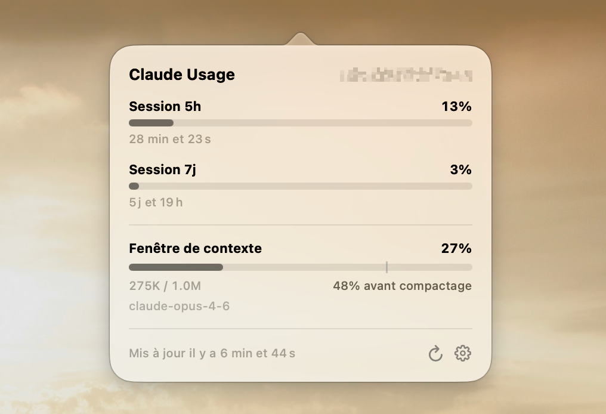

# Claude Usage Mini

<p align="center">
  
</p>

A lightweight macOS menu bar app to monitor your Claude usage in real-time.

Available in **English** and **French**.

## Features

- **5h & 7d session tracking** — See your rolling usage windows at a glance
- **Context window monitor** — Track context fill percentage before auto-compact kicks in
- **Notifications** — Get alerted when approaching usage limits
- **Customizable** — Polling interval, monochrome mode, menu bar icon style, global hotkey
- **Bilingual** — Full French and English interface

## Download

Grab the latest `.dmg` from the [Releases](https://github.com/jeremy-prt/claude-usage-mini/releases) page.

Or visit the [landing page](https://jeremy-prt.github.io/claude-usage-mini/) for more info.

## Install

1. Open the `.dmg` and drag the app to `/Applications`
2. Right-click the app → **Open** (required once for unsigned apps)
3. Click the menu bar icon → **Sign in with Claude**
4. Authorize in your browser, paste the token back in the app

## Build from source

Requires **macOS 26+** and **Xcode 26+** (Swift 6.2).

```bash
git clone git@github.com:jeremy-prt/claude-usage-mini.git
cd claude-usage-mini
./build-app.sh        # Build the .app bundle
./build-dmg.sh        # Build the .dmg installer
```

The app bundle will be at `.build/app/Claude Usage Mini.app`.

## How it works

- **Usage data** is fetched via the Anthropic OAuth API (`/api/oauth/usage`) — same as the official Claude dashboard
- **Context window** is estimated by reading local Claude Code session files (`~/.claude/projects/`)
- **Authentication** uses OAuth PKCE flow through `claude.ai`

## License

[BSD-2-Clause](LICENSE)

Original project: [claude-usage-bar](https://github.com/Blimp-Labs/claude-usage-bar) by Krystian
